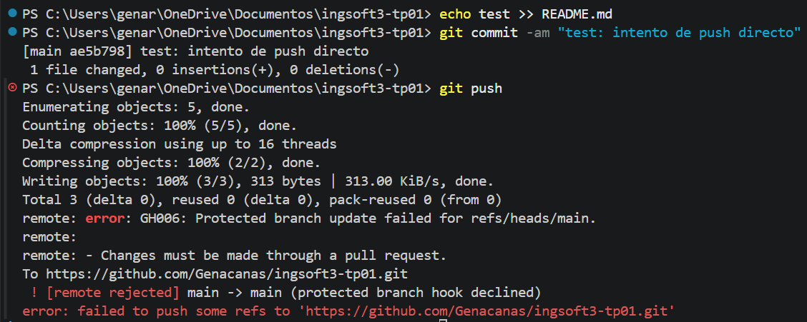
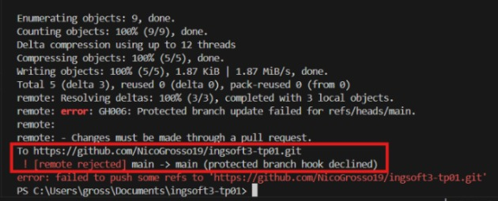
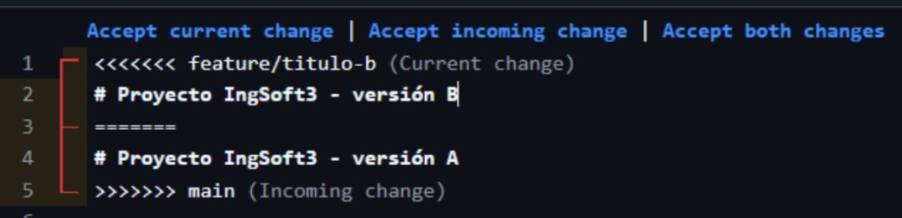
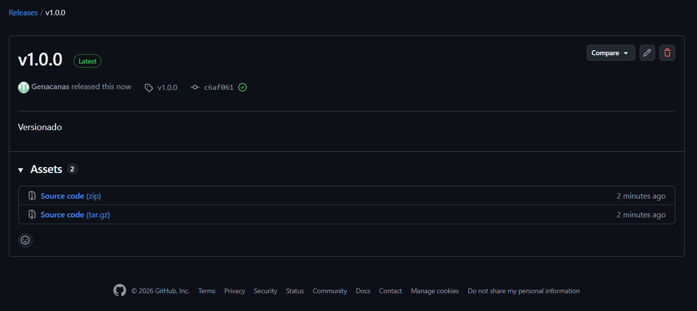
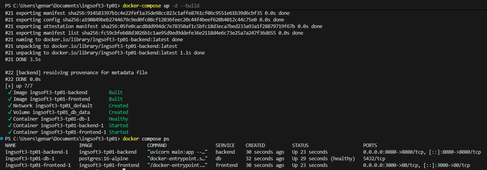
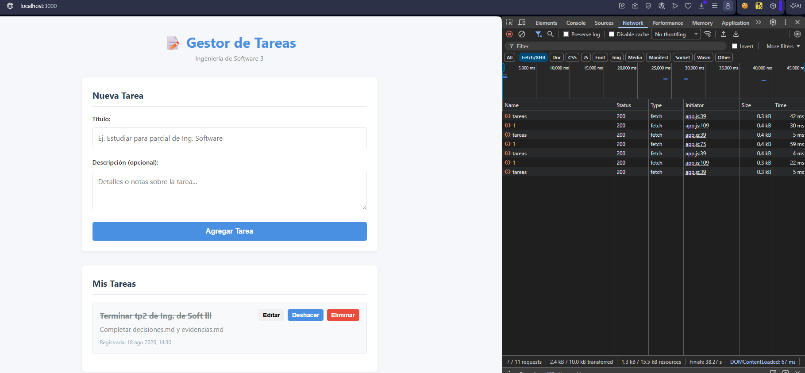
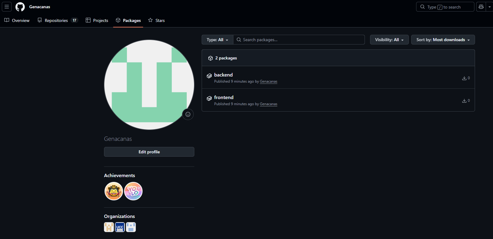
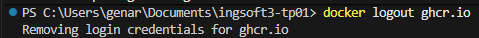
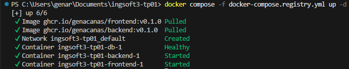

# Evidencias — TP1

## 1. Push directo a main rechazado

GitHub rechaza el push porque main está protegida y la regla alcanza también al dueño del repo.

## 2. El PR de la rama B no se puede mergear: conflicto

## 3. Resolucion de conflicto

## 4. Release en Github

---
# Evidencias — TP2

## 1. Docker compose up ejecutado + docker compose ps

## 2. Frontend interactuando con la base de datos y backend

## 3. Packages subidos a github

## 4. Contenedores corriendo, con imagenes descargadas de la nube y ghcr.io deslogeado

